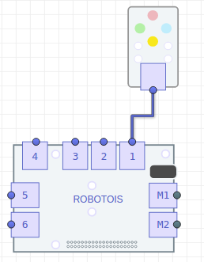

# Primeros Pasos
En esta documentación se mostrará cómo utilizar el módulo de LEDs RGB, en donde se presentarán ejemplos prácticos con los cuales se tendrá un panorama general sobre la utilizad de este módulo. Las aplicaciones de este módulo que se consideran relevantes son las siguientes: se puede utilizar como una lampara RGB, con la cual se podría iluminar un área pequeña; un indicador de eventos, en donde se podrían mostrar la ocurrencia de diversos eventos, uno por cada color.

El módulo de LEDs RGB, consiste en un arreglo de LEDs para los cuales puede ser configurado el color a mostrar. Los colores a mostrar serán especificados siguiendo el formato RGB (*Red, Green, Blue*).

# Instalación de la librería
La instalación de la librería se puede realizar de dos maneras, usando el gestor de paquetes [**npm**](https://www.npmjs.com/package/robotois-rgb-leds), y descargando la última versión disponible en [**GitHub**](https://github.com/Robotois/robotois-rgb-leds).

* Usando el gestor **npm**, la instalación se realiza de la siguiente manera:

```shell
npm install robotois-rgb-leds
```

* Para instalar la última versión, se debe descargar el repositorio en **Github** de la siguiente manera:

```shell
git clone https://github.com/Robotois/robotois-rgb-leds.git
```
y posteriormente se deben instalar las dependencias, también es necesario compilar la librería. Lo anterior se realiza ejecutando en consola, dentro del directorio del repositorio recien descargado (`cd robotois-rgb-leds`): `npm install`.

Otra opción para instalar la librería es usar el gestor *npm* para descargar el repositorio:

`npm install git+https://github.com/Robotois/robotois-rgb-leds.git`

Esta opción es la mas recomendada para usar la versión mas actual del repositorio, ya que de manera automática se instala la librería en la carpeta `node_modules` del proyecto.

# Conexión al Shield
El módulo de LEDs RGB se puede conectar a cualquiera de los conectores genéricos del Shield, que son los conectores `1-6`. La comunicación se realiza usando el puerto **IIC**, por ello no es necesario especificar el conector del Shield al cual éste se conecta. No obstante, es importante notar que los conectores `M1-M2` son designados a módulos electromecánicos como motores y servomotores.



# Inicialización de la librería

La inicialización de esta librería es bastante sencilla, y se realiza de la siguiente manera:

```javascript
const RGBs = require('robotois-rgb-leds');
const rgb = new RGBs();
```
Con esto ya es posible hacer uso de las funcionalidades disponibles.
